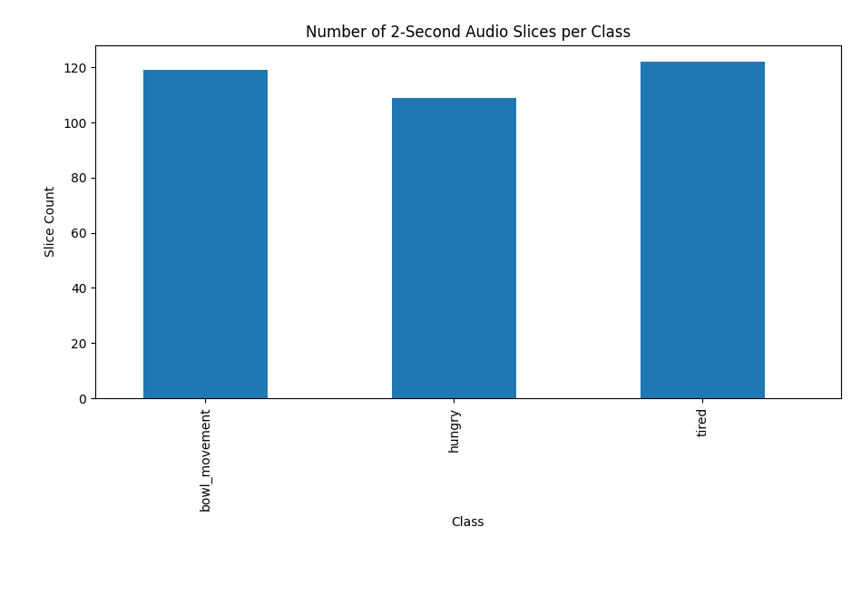
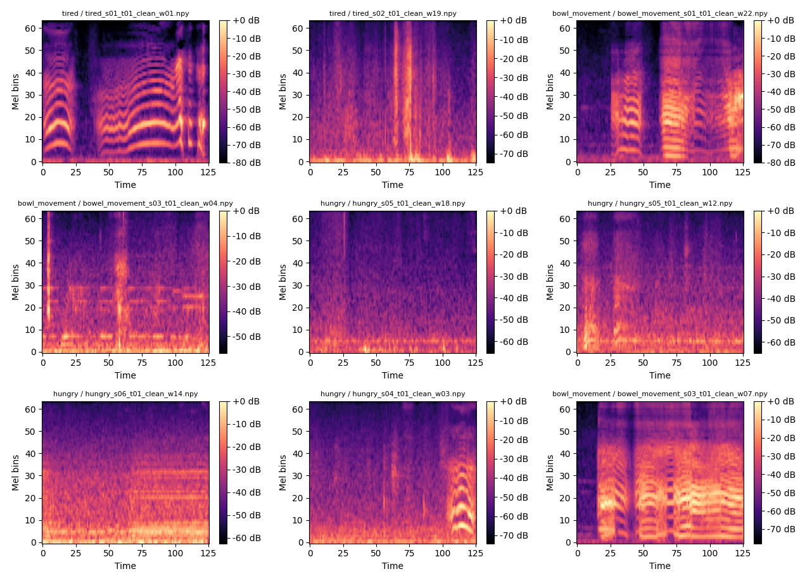

# BStressTranslator

An audio-based stress detection system that classifies stress levels from voice patterns. Built with Python and machine learning.

## Project Phases

## 1. Dataset Engineering
* Each audio recording was carefully organized into class-specific folders with a consistent naming convention (class_sXX_t01.m4a).
* This approach ensures clear traceability of each recording session and simplifies batch preprocessing with Librosa. By maintaining structured, labeled data from the outset, I optimized the workflow for training on the Jetson Nano, where memory and CPU constraints require efficient, predictable input.
* Attention to reproducibility and edge-AI constraints in real-world audio modeling.
> ATTEN: Offset class imbalance with data augmentation if needed

## 2. Preprocessing Pipeline & Dataset Preparation
`preprocess_and_slice.py`
### Preprocess (clean)
* Mono + 16 kHz: Optimized for Nano 128-core Maxwell GPU and 512 MB GPU memory for spectrogram generation.
* Normalization: Ensures spectrogram amplitude is consistent across classes — critical for model convergence.
* Silence trimming: preserves background noise while removing excessive dead space.
* Output: Each .m4a file becomes a cleaned .wav file.
- Optional configuration adjustments:
```
TARGET_SR = 16000          # sample rate
TRIM_SILENCE = True        # whether to trim silence
SILENCE_TOP_DB = 20        # threshold for trimming
WINDOW_LENGTH_SEC = 2.0    # slice length
OVERLAP_SEC = 1.0          # slice overlap
On Jetson Nano, reduce overlap or skip silence trimming for speed.
```
### Slice
> Standardized all audio inputs to fixed 2-second windows to simplify deployment on Ai-edge hardware.
> 2-second overlapping windows capture complete cry patterns, multiply real training data and reduce label noise.

### Summary
* Implemented a reproducible audio preprocessing pipeline by creating two Python scripts. The first script preprocesses raw audio files by converting them to mono, resampling to 16 kHz, normalizing amplitude, optionally trimming silence, and saving the results to a new ```dataset_clean/``` directory. The second script slices these cleaned files into overlapping 2-second windows, generating a windowed dataset in ```dataset_clean_slices/``` suitable for model training.
> In parallel, I generated metadata CSV files describing both the original and sliced audio (e.g., class label, duration, sample rate, file path), enabling traceability, dataset auditing, and downstream training workflows.

==Libraries==
* Core Audio Processing
librosa – audio loading, resampling, silence trimming, duration calculations
soundfile – fast audio I/O and reliable metadata access (WAV writing)
numpy – normalization, numerical operations
* Format Support
pydub – fallback support for formats like .m4a (requires FFmpeg)

### Metadata Visualization
* Validated class distribution via metadata visualization - `/scripts/visualize_metadata.py`
* All three classes were nearly balanced, so no augmentation was applied at this point. 


## 3. Feature Extraction - Log-mel Spectrograms
* Raw audio waveforms are high-dimensional and inefficient for models to process directly.
* Feature extraction transforms raw audio into compact, info dense representations that preserve relevant acoustic patterns while reducing computational cost. 
> Enable faster training and inference within Nano's thermal and memory limits.
* This step **decouples signal** processing from **model learning**, improving reproducibility and allowing feature computation to be done once on desktop and reused on Nano without recomputation.


> Processed all 2-second slices into log-mel spectrograms. 
> Each .npy file contains a `(n_mels, n_frames)` 2-D tensor representing log-mel spectrogram.
> [!NOTE]
> 2-D tensor incompatiable with 4-D tensor needed for CNN model training. 
* Spectrogram is a visual representation of the frequency content of a signal over time - a “heat map” showing how much energy exists at each frequency at each moment.
* Mapping frequencies to the Mel scale makes the features more aligned with human perception - instead of 0–8 kHz linearly, the Y-axis is nonlinear and denser at low frequencies.

==TODO==
Convert the spectrogram into a 4-D tensor with the right shape and semantics for the model.

## 2. Dataset Indexing
`build_dataset_index.py` - Creates train/val/test splits and generates index files mapping sample IDs to file paths and labels.
**OUTPUT**
`dataset_features/logmel/metadata/dataset_index.csv`
```
✅ dataset_index.csv created
✅ class_map.json created
Train samples: 11
Val samples: 2
Test samples: 3
```
> Authoritative split contract between data and model - ensures consistent train/val/test distribution across all experiments.
`dataset_features/logmel/metadata/class_map.json`
```
{
  "bowl_movement": 0,
  "hungry": 1,
  "tired": 2
}
```
> Models train on numbers, not strings
> Mapping is frozen and reproducible
> Inference uses the same mapping later on Jetson Nano

### Summary
* Cataloged all preprocessed audio slices with their file paths, class labels, and assigned train/validation/test splits. This ensures consistent, reproducible access to data during model training while preventing leakage between splits.
* Mapped classes to digestable numerical labels for model training.

## next step: dataset_features/logmel/metadata/dataset_index.csv


